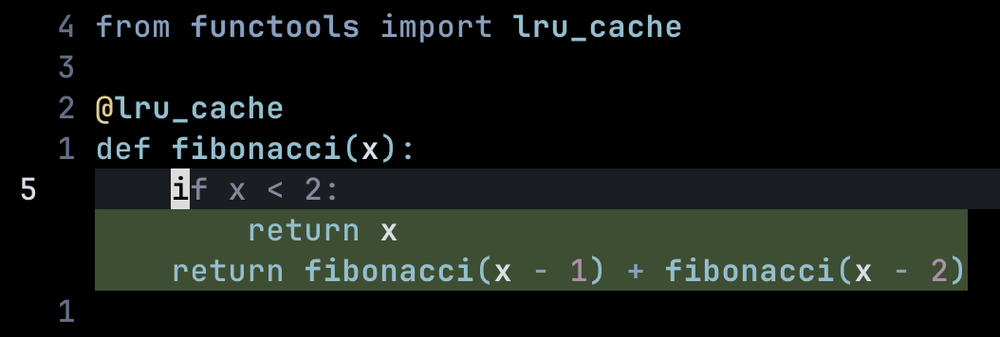

# cursortab.nvim

A Neovim plugin that provides edit completions and cursor predictions. Currently
supports custom models and models form Zeta (Zed) and SweepAI.

> [!WARNING]
>
> **This is an early-stage, alpha project.** Expect bugs, incomplete features,
> and breaking changes.

<p align="center">
    </img>
</p>

## Installation

### Using [lazy.nvim](https://github.com/folke/lazy.nvim)

```lua
{
  "leonardcser/cursortab.nvim",
  build = "cd server && go build",
  config = function()
    require("cursortab").setup()
  end,
}
```

### Using [packer.nvim](https://github.com/wbthomason/packer.nvim)

```lua
use {
  "leonardcser/cursortab.nvim",
  run = "cd server && go build",
  config = function()
    require("cursortab").setup()
  end
}
```

## Configuration

```lua
require("cursortab").setup({
  -- CUSTOMIZATION
  deletion_color = "#4f2f2f",        -- Background color for deletions
  addition_color = "#394f2f",        -- Background color for additions
  modification_color = "#282e38",    -- Background color for modifications
  completion_color = "#80899c",      -- Foreground color for completions
  jump_symbol = "",                 -- Symbol shown for jump points
  jump_text = " TAB ",               -- Text displayed after jump symbol
  jump_show_distance = true,         -- Show line distance for off-screen jumps
  jump_bg_color = "#373b45",         -- Jump text background color
  jump_fg_color = "#bac1d1",         -- Jump text foreground color

  -- OPTIONS
  enabled = true,                    -- Whether the plugin is enabled on startup
  provider = "autocomplete",         -- Provider: "autocomplete", "sweep", or "zeta"
  idle_completion_delay = 50,        -- Delay in ms after being idle to trigger completion (-1 to disable)
  text_changed_debounce = 50,        -- Debounce in ms after text changed to trigger completion
  completion_timeout = 5000,         -- Timeout in ms for completion requests
  cursor_prediction = {
    enabled = true,        -- Show jump indicators after completions
    auto_advance = true,   -- On no-op (no changes), jump to last line and retrigger
    dist_threshold = 2,    -- Lines apart to trigger staging (0 to disable)
  },

  -- CONTEXT OPTIONS
  -- Controls window size around cursor. For sweep/zeta, also controls max generation tokens
  -- since these providers regenerate the entire window.
  max_context_tokens = 2048,         -- Max tokens for content window (0 = no limit)
  max_diff_history_tokens = 512,     -- Max tokens for diff history (0 = no limit)

  -- PROVIDER OPTIONS
  provider_url = "http://localhost:8000",  -- URL of the provider server
  provider_model = "autocomplete",         -- Model name
  provider_temperature = 0.0,              -- Sampling temperature
  provider_max_tokens = 256,               -- Max tokens to generate (autocomplete only)
  provider_top_k = 50,                     -- Top-k sampling
})
```

### Providers

The plugin supports three AI provider backends: Autocomplete, Sweep, and Zeta.
Configuration options for all providers use the unified `provider_*` settings.

#### Autocomplete Provider (Default)

End-of-line completion using OpenAI-compatible API endpoints.

**Features:**

- End-of-line completion only
- No cursor jump predictions
- Stop at newline characters
- Works with any OpenAI-compatible `/v1/completions` endpoint

**Requirements:**

- An OpenAI-compatible completions endpoint

**Example Configuration:**

```lua
require("cursortab").setup({
  provider = "autocomplete",
  provider_url = "http://localhost:8000",
  provider_model = "autocomplete",
})
```

#### Zeta Provider

Local model support with OpenAI-compatible API format.

**Features:**

- End-of-line completion
- Local model execution
- OpenAI-compatible API

**Example Configuration:**

```lua
require("cursortab").setup({
  provider = "zeta",
  provider_url = "http://localhost:8000",
  provider_model = "zeta",
})
```

#### Sweep Provider

Sweep Next-Edit 1.5B model for fast, accurate next-edit predictions.

**Features:**

- Multi-line completions with token-based context (sends full file for small files, trimmed around cursor for large files)
- Fast inference (~500ms on CPU, <100ms on GPU)
- Outperforms larger models on next-edit accuracy
- Open-source weights available
- OpenAI-compatible API format

**Requirements:**

- vLLM or compatible inference server
- Sweep Next-Edit model downloaded from
  [Hugging Face](https://huggingface.co/sweepai/sweep-next-edit-1.5b)

**Example Configuration:**

```lua
require("cursortab").setup({
  provider = "sweep",
  provider_url = "http://localhost:8000",
  provider_model = "sweep-next-edit-1.5b",
})
```

**Setup Instructions:**

```bash
# Using llama.cpp (recommended)
# Download the GGUF model and run llama-server
llama-server -hf sweepai/sweep-next-edit-1.5b-GGUF --port 8000

# Or with a local GGUF file
llama-server -m sweep-next-edit-1.5b.q8_0.v2.gguf --port 8000
```

## Usage

- **Tab Key**: Navigate to cursor predictions or accept completions
- **Esc Key**: Reject current completions
- The plugin automatically shows jump indicators for predicted cursor positions
- Visual indicators appear for additions, deletions, and completions
- Off-screen jump targets show directional arrows with distance information

### Commands

- `:CursortabToggle`: Toggle the plugin on/off
- `:CursortabShowLog`: Show the cursortab log file in a new buffer
- `:CursortabClearLog`: Clear the cursortab log file
- `:CursortabStatus`: Show detailed status information about the plugin and
  daemon
- `:CursortabRestart`: Restart the cursortab daemon process

## Requirements

- Go 1.24.2+ (for building the server component)
- Neovim 0.8+ (for the plugin)

## Development

### Build

To build the server component:

```bash
cd server && go build
```

### Test

To run tests:

```bash
cd server && go test ./...
```

### Internal Configuration Options

Advanced configuration options for development and debugging:

```lua
require("cursortab").setup({
  -- INTERNAL OPTIONS
  log_level = "info",                 -- Log level: "debug", "info", "warn", "error"
  event_debounce = 10,                -- Debounce in ms for events
  debug_immediate_shutdown = false,   -- Shutdown daemon immediately when no clients are connected
  debug_color = "#cccc55",            -- Foreground color for debug highlights (currently not used)
})
```

These options are primarily for plugin development and debugging. Most users
should not need to modify them.

## Contributing

Contributions are welcome! Please open an issue or a pull request.

Feel free to open issues for bugs :)

## License

This project is licensed under the MIT License - see the [LICENSE](LICENSE) file
for details.
